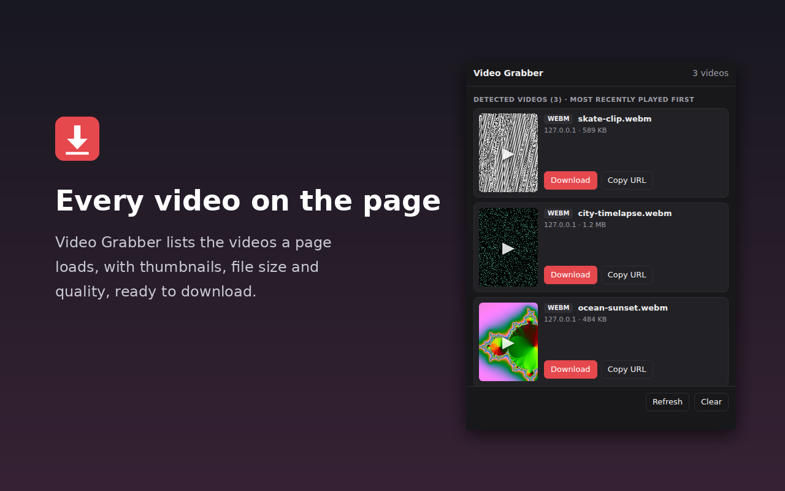

# Video Grabber

A Manifest V3 Chrome extension for finding and saving videos, audio and playlists from the page you are viewing. Version **1.3.0** includes a dedicated **Media Scanner** tab.



Only download content you own, that is public domain, or that you have permission to save.

## Features

- **Video Grabber:** thumbnails, previews, quality selection and direct video downloads.
- **Media Scanner:** Audio / Video / Playlists filters, filenames, sizes, source domains, Copy URL and Download all.
- **Automatic detection:** observes HTTP(S) responses and scans media elements, source tags and media links in page frames.
- **HLS to MP4:** merges segments and converts H.264/AAC transport streams locally without re-encoding or installing FFmpeg.
- **AES-128 HLS:** local decryption with accessible keys, key rotation and explicit or sequence-derived IVs.
- **Protected playlists:** Download playlist saves the original protected `.m3u8` or `.mpd`.
- **Download queue:** three active Media Scanner jobs, progress and retries; closing the popup does not cancel downloads.
- **Instagram:** full video with sound where the current post/reel lookup succeeds.
- **YouTube:** quality detection in the full build; excluded from the store build.
- Light/dark themes, no accounts, no telemetry and no external processing servers.

## Install

Chrome 116 or newer is required.

### From a release

1. Download a `video-grabber-full-vX.zip` from [GitHub Releases](https://github.com/lolizei/Video-grabber/releases) and unzip it.
2. Open `chrome://extensions` and enable **Developer mode**.
3. Click **Load unpacked** and select the extracted extension folder.

Release archives reflect their tagged version. For changes that have not been released, install from source.

### From source

```bash
git clone https://github.com/lolizei/Video-grabber.git
```

Load the repository root with **Load unpacked**. No build step is required.

After an update, click **Reload** on the extension and reload source pages to update their content scripts.

## Use Video Grabber

1. Open a page and start playing the video.
2. Open the popup and select **Video Grabber**.
3. Preview the video, choose a quality if available and click **Download**.

Keep HLS download tabs open until downloading, conversion and saving finish. If MP4 conversion fails, the original TS file is saved with an explanation.

**Clear** empties the visible results. **Refresh** or reopening the popup can recover detected URLs and buffered media. Detection normally resets on navigation; Instagram/Facebook in-app navigation retains preloaded reels.

## Use Media Scanner

Select **Media Scanner**, choose **Audio**, **Video**, **Playlists** or **All**, then download individual items or use **Download all** for the current filter. Copy URL preserves the complete link, including query parameters.

Detection includes MP3, M4A, AAC, OGG, WAV, FLAC, Opus, MP4, WebM, HLS (`.m3u8`), DASH (`.mpd`) and media recognized by Content-Type. Sizes come from Content-Length or Content-Range when available.

Results are deduplicated by full URL and kept per tab in temporary session storage. The scanner resets on navigation, SPA URL changes and reloads. Clear removes results; Refresh rescans the page.

Up to three queued jobs run at once. Reopen the popup to see progress, keep playlist download tabs open until completion, and use Retry for failures. Download all skips protected items.

### Playlists and protection

| Stream | Download behavior |
|---|---|
| Unencrypted HLS | Fetches and merges segments; supported MPEG-TS media converts to MP4. |
| AES-128 HLS with identity key format | Fetches accessible keys, decrypts locally, then merges/converts media. |
| SAMPLE-AES or non-identity DRM key format | Marked Protected; Download playlist saves the original `.m3u8` only. |
| DASH with ContentProtection | Marked Protected; Download playlist saves the original `.mpd` only. |
| Unprotected DASH | Download manifest saves the `.mpd`; DASH media assembly is unsupported. |

Protected-playlist downloads retain their protection tags. They do not download encrypted segments, obtain DRM licenses or produce decrypted playable video. Formats such as Widevine, PlayReady and FairPlay remain protected.

Master playlists are checked recursively. Failed protection checks are shown, and normal media downloads check again before saving. HLS variants with separate audio require a separate audio download.

## Limits and troubleshooting

- **Blob URLs:** player-local `blob:` references are skipped; underlying HTTP files/playlists can still be detected.
- **Expired links:** reload the source page, start playback and refresh the popup.
- **Referrer/CORS restrictions:** an allowed fallback can fetch from the original page/frame using its recorded Referer and existing session, subject to browser policies. Forbidden headers are not overridden. The page fallback is limited to 32 MB per request.
- **Large/live streams:** HLS and fallback files are assembled in memory; available RAM limits size. Live HLS saves only currently listed segments.
- **YouTube:** video/audio often arrive separately. Merge tracks with `ffmpeg -i video.mp4 -i audio.m4a -c copy out.mp4`. Unsupported streaming formats may require the full build's Copy yt-dlp command fallback.
- **Instagram:** lookup needs your existing logged-in session; fallback video/audio tracks may be separate.
- **Protected playback:** saving a playlist does not make its protected media playable outside an authorized player.

## Permissions and privacy

| Permission | Purpose |
|---|---|
| `webRequest` | Observe media responses and read type, size and Referer headers without blocking/modifying requests. |
| `downloads` | Save files, monitor progress/errors and advance the queue. |
| `storage` | Keep detections and job state in `chrome.storage.session` across worker restarts. |
| `scripting` | Rescan already-open pages/frames and preserve video/Instagram lookup. |
| HTTP/HTTPS host access | Detect and fetch media from visited pages and their CDNs, whose hosts are not known in advance. |

All code and conversion libraries are bundled. Processing happens locally; requests go directly to the original page/media hosts. No analytics or uploads to developer processing servers are used. Session storage includes media URLs, referrers and download status. See [PRIVACY.md](PRIVACY.md).

## Build packages

| Build | YouTube detection | Distribution |
|---|---|---|
| `full` | Enabled | GitHub releases and unpacked installation |
| `store` | Disabled in both popup tabs | Chrome Web Store package |

Build scripts set `config.js` for each package and create both ZIPs in `dist/`.

```powershell
# Windows
powershell -ExecutionPolicy Bypass -File scripts\build.ps1
```

```bash
# macOS / Linux
bash scripts/build.sh
```

Version tags trigger the GitHub Actions release workflow. See [CHANGELOG.md](CHANGELOG.md).

## Development and testing

Node.js is required for automated checks. FFmpeg and ffprobe must be on PATH for conversion/HLS integration checks; extension users do not need them.

```bash
node scripts/test-rediscovery.cjs
node scripts/test-conversion.cjs
node scripts/test-scanner.cjs
node scripts/test-hls-download.cjs
```

Checks cover rediscovery, conversion, classification, deduplication, session recovery, navigation, queue limits/retries, AES-128 and protected-playlist handling. The HLS integration check uses local generated fixtures on port 18765.

Follow the [manual Chrome test checklist](docs/MEDIA-SCANNER-TESTS.md). Generate local test media with:

```bash
node scripts/manual-fixtures.cjs
```

Open `http://127.0.0.1:8765/`. Fixtures use generated tones and test patterns. The optional popup preview uses mock Chrome APIs and does not verify extension permissions or worker lifecycle behavior.

## Project layout

```text
manifest.json           Manifest V3 configuration
background.js           Existing Video Grabber detection/messages
background/scanner.js   Scanner state, playlist checks and queue
content/dom-scan.js     DOM scan and permitted page fetch fallback
ui/media-tab.js         Scanner popup UI
shared/                Classification, filename and playlist helpers
popup.html / popup.js  Popup, previews and existing site integrations
downloader.html / .js  HLS, chunked streams and playlist download page
ts-converter.js        Local MPEG-TS to MP4 worker
vendor/                Bundled mux.js and license
scripts/               Builds, checks and local fixtures
docs/                  Manual test checklist
store/                 Listing materials and screenshots
```

## License

[MIT](LICENSE) © 2026 lolizei. Bundled [mux.js](https://github.com/videojs/mux.js) uses [Apache-2.0](vendor/mux.LICENSE).
